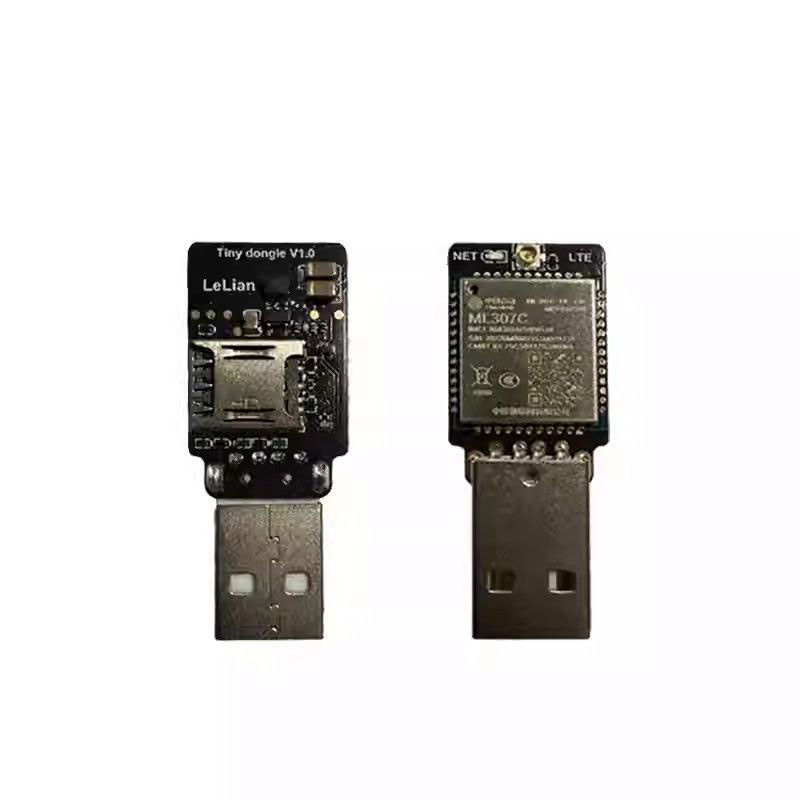

# SMS Relay

A tiny native macOS menu-bar app that bridges **USB Cat.1 modems** to **Telegram**:
incoming SMS are forwarded to a Telegram chat, and you can reply straight from Telegram to
send an SMS back through the SIM. Built to run unattended on a 24/7 Mac (e.g. a Mac mini).

- **Two-way SMS** — forward incoming SMS to Telegram; reply in Telegram to send one back.
- **Multiple modems** — plug in ML307C and Air780EPM sticks together; pick a SIM in the header
  to see that stick’s inbox, settings, and log. Each modem can send to its own Telegram chat.
- **Reliable by design** — persistent SQLite queue, automatic reconnect, heartbeat, network
  re-registration watchdog, USB re-enumeration for a wedged modem, and launchd supervision.
- **Never uses the modem for internet** — disables the modem's USB-Ethernet interface on macOS
  and its host auto-dialup, so your Wi-Fi/LAN stays the default route.
- **Light** — ~16 MB RAM, ~0% CPU idle. No Electron, no runtime, no dependencies.

## Hardware

Supported USB Cat.1 sticks:

- China Mobile **ML307C** (LeLian tiny dongle) — stock AT firmware.
- Hezhou **Air780EPM** — must flash `firmware/air780epm/` (LuatOS AT-SMS bridge). Official AT firmware does not exist for EPM. The button next to USB is **BOOT** (download mode), not “root”.

<p align="center">
  
</p>

## Requirements

- macOS 14 (Sonoma) or later, Apple silicon.
- An ML307C or Air780EPM USB modem with an SMS-capable SIM.
- A Telegram bot token and a chat ID (see setup).

## Install

1. Download the latest `SMS-Relay-<version>-arm64.dmg` from the
   [Releases](../../releases) page.
2. Open the DMG and drag **SMS Relay** onto **Applications**.
3. The app is ad-hoc signed (no Apple Developer ID). On first launch Gatekeeper may block it —
   right-click the app → **Open**, or run:
   ```sh
   xattr -dr com.apple.quarantine "/Applications/SMS Relay.app"
   ```
4. Launch it. A signal-bars icon appears in the menu bar. On first run from `/Applications`
   it enables "run at login & restart if it crashes" automatically.

## Set up Telegram

1. Create a bot with [@BotFather](https://t.me/BotFather) and copy the **token**.
2. Start a chat with your bot (or add it to a group) and send it any message.
3. In the app: **Settings → Telegram**, paste the token, click **Find…** to auto-detect the
   **chat ID**, then **Send test message** to confirm.
4. Turn on **Forward new messages**.

## Usage

- **Forwarding** — incoming SMS appear in the chat, tagged with the receiving SIM number.
- **Reply** — reply to a forwarded message in Telegram and it's sent back to that number via
  the same SIM. Long messages and unicode/emoji are handled automatically.
- **/sms** — `‎/sms +639171234567 your message` sends to any number (via the primary modem).
- **/status** — modem, network, SIM and queue summary for every attached modem.

Optional: restrict who can send with **allowed Telegram user IDs** in Settings.

## Running 24/7 on a Mac mini

- Enable **automatic login** for the user (System Settings → Users & Groups). A menu-bar app
  only starts once a user session exists. FileVault must be off for auto-login.
- Recommended: `sudo pmset -a autorestart 1 sleep 0` so it boots and stays awake on power.
- The app keeps the Mac from idle-sleeping while a modem is connected (toggle in Settings).

## How it stays reliable

| Failure | Recovery |
| --- | --- |
| App crashes | launchd relaunches it (clean Quit is respected) |
| Modem AT interface hangs | reconnect after missed heartbeats |
| Modem enumerated but silent | per-device USB re-enumeration |
| No network registration | explicit attach, then airplane-mode toggle |
| Wi-Fi / Telegram down | messages persist in SQLite, retried with backoff |
| Telegram rate limit (429) | honours `retry_after`, paces group sends |

Messages are deleted from the SIM only after they're safely committed to SQLite; multipart SMS
are reassembled; delivery is at-least-once.

## Data & logs

- Database (messages + settings): `~/Library/Application Support/SMSRelay/smsrelay.sqlite`
- Log: `~/Library/Logs/SMSRelay/smsrelay.log`

Your Telegram token is stored in the local SQLite database (user-only readable), not in the app
bundle or this repository.

## Build from source

```sh
make dmg      # release build + bundle + build/SMS-Relay-<version>-arm64.dmg
make run      # build the .app and launch it
make debug    # run the debug binary in the foreground (AT trace on stderr)
```

Requires Xcode 15.4+ (Swift 5.10). To sign with a real certificate:
`CODESIGN_IDENTITY="Developer ID Application: …" make dmg`.

Releases are built automatically by GitHub Actions on every `v*` tag (see
`.github/workflows/release.yml`).

## License

[MIT](LICENSE).
